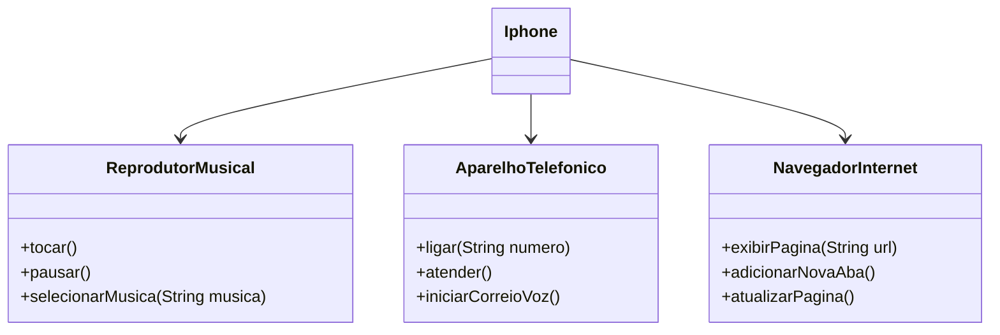

# Desafio UML Iphone

Para entender como que funciona as UTM e como criar uma, criei um "projeto" no [mermaid](https://mermaid.live/). Foi uma UTM bem simples conforme foi solicitado no projeto do curso da DIO.

Nela possuimos 3 funcionalidades divididos em 3 classes sendo elas o Reprodutor Musical, Aparelho Telefônico e o Navegador de internet todas essas classes ficaram dentro do package chamado Iphone e cada uma dessas classes possuem 3 funções

### Reprodutor Musica

No reproduto musical temos 3 métodos básicos os métodos de Tocar, Pausar e Selecionar Música

### Aparelho Telefônico

No aparelho telefônico possuimos 3 métodos também o de Ligar, atender e Correio de voz

### Navegador de internet

Para a navegação também foi criado 3 métodos sendo eles o exibir página, atualizar página e nova aba

